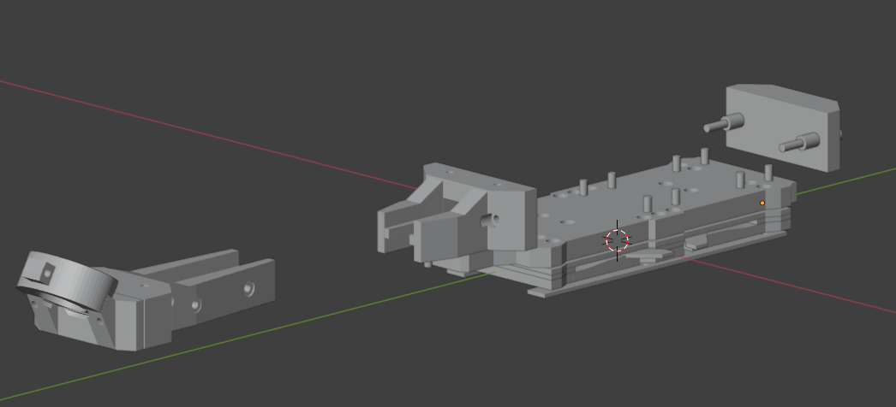
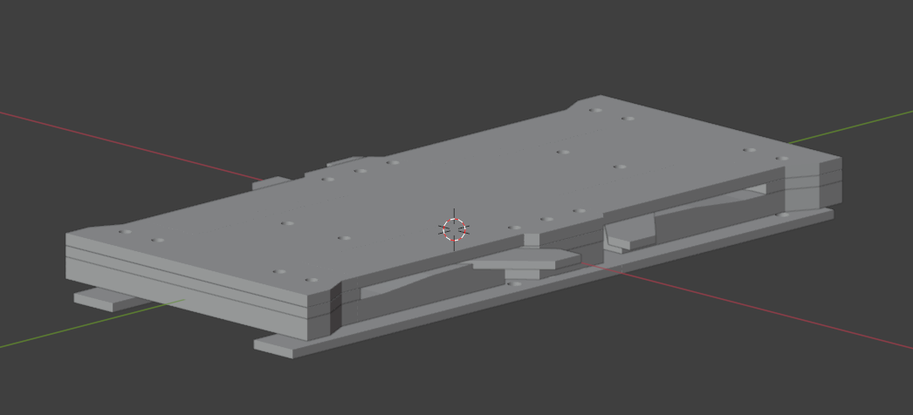

# Robotics Project 2024/2025

This is the code repository for the 2024 RL robotics project at LUHAI.  
Isaacgym simulation is used instead of IsaacLab because of compatibility issues with the LUIS-Cluster.

## Plant Watering with Unitree GO2

Low-Level Policy in Simulation (TODO update video)
[](https://github.com/user-attachments/assets/98395d82-d3f6-4548-b6ee-8edfce70ac3e)

High-Level Policy in Simulation
TODO

## Tool

For the actual deployment, we developed and 3d printed some plant watering tool for the Go2.

For fast and easy mounting/unmounting, we also developed a custom mechanism with handles,
that could easily be used for other projects build on top of the Go2.

All parts of the mounting mechanism as well as the tool for this project are in the 3d_printed_parts directory.

## Documentation
* A Guide for the setup/installation can be found in **SETUP.md**. 
* IsaacGym: https://docs.robotsfan.com/isaacgym/
* Unitree RL GYM: https://github.com/unitreerobotics/unitree_rl_gym


Information on how to operate Heinrich can be found in the documentation page. These are the basic fact on Heinrich's usage with more advanced concepts like RL deployment not being explicitly stated since there are often multiple options on working with low level control, i.e. ROS. 
Still, there are some additional manuals linked for a more in-depth look and the code examples should give you insights on how to accomplish your specific goals.

#### Installing Dependencies (from template)

You can install the dependencies for training, deployment or both via "make install-train", "make install-deploy" and "make install". Be aware that the last two require root access and either a x86_64 or a aarch64 architecture. IsaacLab is currently only supported on Linux and Windows.

## Training
```
conda activate unitree_rl_env
cd /bigwork/<username>/user/isaacgym
python -m training_code_isaacgym.train
```
* **Important** : To improve performance, once the training starts press `v` to stop the rendering. You can then enable it later to check the progress.
* The trained policy is saved in `logs/<experiment_name>/<date_time>_<run_name>/model_<iteration>.pt`. Where `<experiment_name>` and `<run_name>` are defined in the train config or set via command line arguments.
* For further options check 
```
python -m training_code_isaacgym.train -h
```
You could also train both, low-level and high-level policies, by running the train.sh script:
```
./train.sh
```

### Advanced Training Customization
All necessary code is in `training_code_isaacgym`.
Despite using cli-arguments, you can change the training setup by adding new configurations for the RL algorithms, the robot or the scene.
Moreover, you can add further assets or change the robot behaviour of the low-level policy or the high-level policy by e.g. reward shaping in environments/task.py.  
**More information is given in training_code_isaacgym/README.md**


## Inference
To view a policy/checkpoint you can use the `play.py` script:
```
python -m training_code_isaacgym.play path/to/your/checkpoint.pt
```
Additional arguments like `--num_envs` or `--scene` are the same as for the `train.py` script

## Deployment
TODO