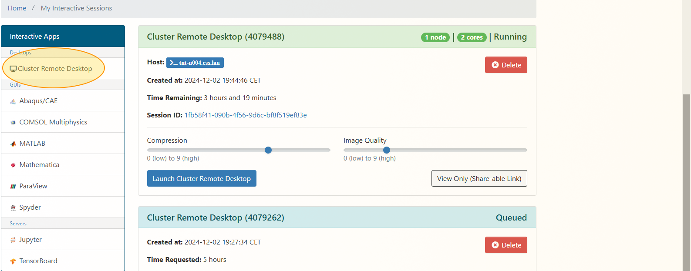

# Unitree RL GYM for the Go2
### Cluster specific installation instruction


This is a simple example of using Unitree Robots for reinforcement learning, including the Unitree Go2

## Installation
This first part of the installation should be done on the shell, since the Cluster Remote Desktop only allows limited access to the internet for installations.
The cluster could be either accessed with a shell via a webbrowser: https://login.cluster.uni-hannover.de/pun/sys/shell/ssh/127.0.0.1 or via SSH:
## SSH login
   Connect to the cluster using Putty or anything similar:
   ```
   <username>@login.cluster.uni-hannover.de
   ```
1. Create a new python virtual env with python 3.6, 3.7 or 3.8 (3.8 recommended)
   ```
   conda create -n unitree_rl_env python=3.8 -y
   conda activate unitree_rl_env
   ```
2. Navigate into the repo, which optimally should be in `$BIGWORK`.
3. Install Isaac Gym

   - Download and install Isaac Gym Preview 4 from [https://developer.nvidia.com/isaac-gym](https://developer.nvidia.com/isaac-gym)
   ```
   wget https://developer.nvidia.com/isaac-gym-preview-4 --output-document /tmp/isaac-gym-preview-4.tar.gz
   tar -xvzf /tmp/isaac-gym-preview-4.tar.gz
   cd isaacgym/python && pip install -e .
   ```
   - For troubleshooting check docs isaacgym/docs/index.html
4. Install rsl_rl (PPO implementation)

   - Clone [https://github.com/leggedrobotics/rsl_rl](https://github.com/leggedrobotics/rsl_rl)
   ```
   git clone https://github.com/leggedrobotics/rsl_rl
   cd rsl_rl
   pip install -e .
   ```
5. Install unitree_rl_gym
   ```
   git clone https://github.com/unitreerobotics/unitree_rl_gym
   cd unitree_rl_gym
   pip install -e .
   ```
6. Install all other dependencies. Go back to the root of the git repository for this.  
`pip install .`  
7. Export all library paths. This step is sometimes also required after creating a new session:
   ```
   export LD_LIBRARY_PATH=/bigwork/<username>/.conda/envs/<venv name>/lib:$LD_LIBRARY_PATH
   ```
## Graphical interface


2. Log into the interactive sessions website of the university cluster:
https://login.cluster.uni-hannover.de/pun/sys/dashboard/batch_connect/sessions
2. Navigate to the "Interactive Apps" field and start a new "Cluster Remote Desktop" session.
3. Select
* number of hours (eg. 5h)
* number of cpu cores (e.g. 8)
* memory per CPU core (so that #cores * memory > 32GB)
* a single RTX compatible GPU (rtxa6000:1)
* cluster partition (tnt as the only available)
   - Test isaacsim 
   ```
   cd isaacgym/python/examples
   python 1080_balls_of_solitude.py
   ```
## Training
   ```
   python unitree_rl_gym/legged_gym/scripts/train.py --task=go2
   ```

   * To run on CPU add following arguments: `--sim_device=cpu`, `--rl_device=cpu` (sim on CPU and rl on GPU is possible).
   * To run headless (no rendering) add `--headless`.
   * **Important** : To improve performance, once the training starts press `v` to stop the rendering. You can then enable it later to check the progress.
   * The trained policy is saved in `logs/<experiment_name>/<date_time>_<run_name>/model_<iteration>.pt`. Where `<experiment_name>` and `<run_name>` are defined in the train config.
   * The following command line arguments override the values set in the config files:
   * --task TASK: Task name.
   * --resume: Resume training from a checkpoint
   * --experiment_name EXPERIMENT_NAME: Name of the experiment to run or load.
   * --run_name RUN_NAME: Name of the run.
   * --load_run LOAD_RUN: Name of the run to load when resume=True. If -1: will load the last run.
   * --checkpoint CHECKPOINT: Saved model checkpoint number. If -1: will load the last checkpoint.
   * --num_envs NUM_ENVS: Number of environments to create.
   * --seed SEED: Random seed.
   * --max_iterations MAX_ITERATIONS: Maximum number of training iterations.
### Custom training environment
   Navigate to the envs directory:
   ```
   cd unitree_rl_gym/legged_gym/envs
   ```
   In this example the existing go2 env will be changed:
   ```
   cp -r go2 go2_test1
   cd go2_test1
   mv go2_config.py go2_test1_config.py
   nano go2_test1_config.py
   ```
   Change some of the objectives like "base_height_target = 0.5", close and register the new environment.
   For our example, you could also add some fast rotation reward:
   ```
    class rewards( LeggedRobotCfg.rewards ):
        soft_dof_pos_limit = 0.9
        base_height_target = 0.5
        class scales( LeggedRobotCfg.rewards.scales ):
            torques = -0.0002
            dof_pos_limits = -10.0
            fast_rotation = 5.0
   ```
   Now we would have to register the new environment. navigate to and open the __init__.py:
   ```
   cd unitree_rl_gym/legged_gym/envs
   nano __init__.py
   ```
   And add the line to import and the line to register the new policy:
   ```
   from legged_gym.envs.go2_test1.go2_test1_config import GO2RoughCfg, GO2RoughCfgPPO
   ...
   task_registry.register( "go2_test1", LeggedRobot, GO2RoughCfg(), GO2RoughCfgPPO())
   ```
   Now we would have to add the custom reward to the robot class:
   ```
   cd unitree_rl_gym/legged_gym/envs/base
   nano legged_robot.py
   ```
   And add:
   ```
   def _reward_fast_rotation(self):
       """
       Reward for fast rotations based on the z-axis angular velocity of the base.
       """
       # Reward is proportional to the absolute value of the z-axis angular velocity
       return torch.abs(self.base_ang_vel[:, 2])
   ```
   to the bottom of the script. Now just run:
   ```
   python unitree_rl_gym/legged_gym/scripts/train.py --task=go2_test1
   ```
## Inference
   ```
   python unitree_rl_gym/legged_gym/scripts/play.py --task=go2
   ```

   * By default, the loaded policy is the last model of the last run of the experiment folder.
   * Other runs/model iteration can be selected by setting `load_run` and `checkpoint` in the train config.

   
   https://github.com/user-attachments/assets/98395d82-d3f6-4548-b6ee-8edfce70ac3e

